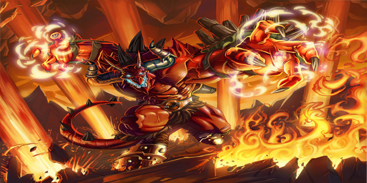
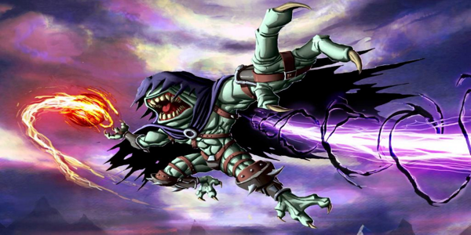
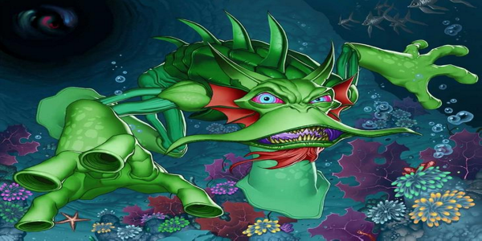
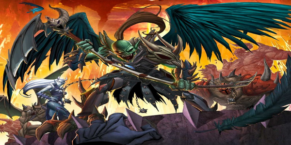

# Chaotic-Drome-Simulator-MVP
 One simulator of Chaotic deck builder Drome. All nostalgia of animation in a simple interface! 

-How to add my cards?

there are two paths:

1- overwrite existing cards. you just need to rename your image (600 x 300) to slidenumber.png.
Example: in Chaotic-Drome-Simulator-MVP \ img, you named your card slide0.png and replace Chaor.
0 of 3 are the underworlds,4 of 7 are the Mipedian, 8 of 11 are the overworlds  and 12 of 15 are the danians.

2- add more cards:

It is a little complicated. You need to open imgs.js to search for $ ('. Carousel'). Carousel (0) and change all numbers  to the new number cards. 

Example: the function nextUnderworld ()  causes the carousel to start on slide 0 (Chaor) whenever it is clicked and the  function prevUnderworld ()  causes the carousel to start on slide 3 (VanBloot). To add a new card from the underworld, you need to change the function prevUnderworld () $ ('. Carousel') . Carousel (3) to $ ('. Carousel'). Carousel (4) and all other $ ('. Carousel'). Carousel () to the original +1. you will also need to add your img in html:

                          
                        

                        

                            
                        

                        

                            
                        

                        

                            
                        

                        

                            
                        

                 
                        
                        
                        
